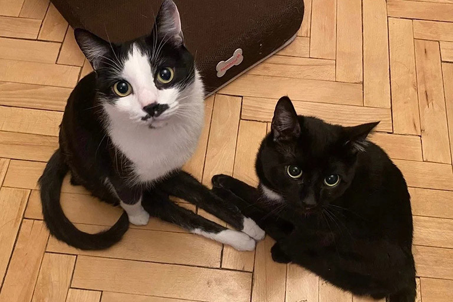

# Наша команда

Мы разрабатываем проект software-engineering.

## Участники

- Андрей — разработка и инфраструктура.
- Участник 2 — тестирование.
- Участник 3 — документация.

## Правила работы

1. Обсуждаем задачи в GitHub Issues.
2. Вносим изменения через Pull Requests.
3. Поддерживаем документацию в актуальном состоянии.

[На главную](index.html)
